# Schéma de base de données — PA-SAP Bridge

Base PostgreSQL : `pa_sap_bridge`  
ORM : Prisma (généré depuis `packages/database/prisma/schema.prisma`)

## Diagramme Mermaid

```mermaid
erDiagram
    Invoice {
        uuid   id              PK
        string pa_message_id   UK "Idempotence PA"
        string pa_source
        enum   direction       "INVOICE | CREDIT_NOTE"
        enum   format          "FACTUR_X | UBL | CII | PDF_ONLY | CSV | OTHER"
        ts     received_at
        string supplier_pa_identifier
        string supplier_name_raw
        string supplier_b1_cardcode    "null si non résolu"
        int    supplier_match_confidence "0-100"
        string doc_number_pa
        date   doc_date
        date   due_date        "nullable"
        char3  currency        "ISO 4217"
        dec    total_excl_tax
        dec    total_tax
        dec    total_incl_tax
        enum   status          "NEW|TO_REVIEW|READY|POSTED|REJECTED|ERROR"
        string status_reason   "nullable"
        enum   integration_mode "SERVICE_INVOICE|JOURNAL_ENTRY nullable"
        int    sap_doc_entry   "nullable"
        int    sap_doc_num     "nullable"
        int    sap_attachment_entry "nullable"
        ts     sap_attachment_uploaded_at "nullable"
        ts     pa_status_sent_at "nullable"
        ts     created_at
        ts     updated_at
    }

    InvoiceLine {
        uuid   id             PK
        uuid   invoice_id     FK
        int    line_no
        string description
        dec    quantity
        dec    unit_price
        dec    amount_excl_tax
        string tax_code       "nullable"
        dec    tax_rate       "nullable %"
        dec    tax_amount
        dec    amount_incl_tax
        string suggested_account_code  "nullable"
        int    suggested_account_confidence "0-100"
        string suggested_cost_center   "nullable"
        string suggested_tax_code_b1   "nullable"
        string suggestion_source       "nullable"
        string chosen_account_code     "nullable"
        string chosen_cost_center      "nullable"
        string chosen_tax_code_b1      "nullable"
    }

    InvoiceFile {
        uuid   id          PK
        uuid   invoice_id  FK
        enum   kind        "PDF | XML | ATTACHMENT"
        string path        "Chemin absolu sur disque"
        bigint size_bytes
        string sha256
    }

    SupplierCache {
        uuid   id           PK
        string cardcode      UK "CardCode SAP B1"
        string cardname
        string federaltaxid  "nullable SIREN/NIF"
        string vatregnum     "nullable TVA intra"
        ts     sync_at
    }

    MappingRule {
        uuid   id                PK
        enum   scope             "GLOBAL | SUPPLIER"
        string supplier_cardcode "nullable si GLOBAL"
        string match_keyword     "nullable ILIKE"
        dec    match_tax_rate    "nullable %"
        dec    match_amount_min  "nullable"
        dec    match_amount_max  "nullable"
        string account_code      "AcctCode SAP B1"
        string cost_center       "nullable"
        string tax_code_b1       "nullable ex: S1"
        int    confidence        "0-100 apprentissage"
        int    usage_count
        ts     last_used_at      "nullable"
        string created_by_user
        bool   active
        ts     created_at
        ts     updated_at
    }

    AuditLog {
        uuid   id             PK
        ts     occurred_at
        string sap_user       "nullable = système"
        enum   action         "LOGIN|LOGOUT|FETCH_PA|VIEW_INVOICE|EDIT_MAPPING|APPROVE|REJECT|POST_SAP|SEND_STATUS_PA|SYSTEM_ERROR|CONFIG_CHANGE"
        enum   entity_type    "INVOICE|RULE|CONFIG|SYSTEM|ATTACHMENT"
        string entity_id      "nullable polymorphe"
        jsonb  payload_before "nullable diff avant"
        jsonb  payload_after  "nullable diff après"
        string ip_address     "nullable"
        string user_agent     "nullable"
        enum   outcome        "OK | ERROR"
        string error_message  "nullable"
    }

    PaChannel {
        uuid   id                       PK
        string name                     UK
        enum   protocol                 "SFTP | API"
        string host                     "nullable SFTP"
        int    port                     "nullable SFTP"
        string user                     "nullable SFTP"
        string password_encrypted       "nullable AES-GCM"
        string remote_path_in           "nullable SFTP"
        string remote_path_processed    "nullable SFTP"
        string remote_path_out          "nullable retour statut §9"
        string api_base_url             "nullable API"
        enum   api_auth_type            "nullable BASIC|API_KEY|OAUTH2"
        string api_credentials_encrypted "nullable AES-GCM"
        int    poll_interval_seconds
        bool   active
        ts     last_poll_at             "nullable"
        string last_poll_error          "nullable"
        ts     created_at
        ts     updated_at
    }

    Setting {
        string key       PK
        jsonb  value     "scalaire, objet ou tableau"
        ts     updated_at
    }

    Invoice     ||--o{ InvoiceLine : "lines"
    Invoice     ||--o{ InvoiceFile : "files"
```

## Index de performance

| Table             | Index                            | Colonne(s)             |
| ----------------- | -------------------------------- | ---------------------- |
| `invoices`        | `idx_invoices_status`            | `status`               |
| `invoices`        | `idx_invoices_pa_source`         | `pa_source`            |
| `invoices`        | `idx_invoices_doc_date`          | `doc_date`             |
| `invoices`        | `idx_invoices_cardcode`          | `supplier_b1_cardcode` |
| `invoices`        | `idx_invoices_received_at`       | `received_at`          |
| `invoice_lines`   | `idx_invoice_lines_invoice_id`   | `invoice_id`           |
| `invoice_files`   | `idx_invoice_files_invoice_id`   | `invoice_id`           |
| `suppliers_cache` | `idx_suppliers_cache_cardname`   | `cardname`             |
| `suppliers_cache` | `idx_suppliers_cache_taxid`      | `federaltaxid`         |
| `mapping_rules`   | `idx_mapping_rules_scope_active` | `scope, active`        |
| `mapping_rules`   | `idx_mapping_rules_cardcode`     | `supplier_cardcode`    |
| `mapping_rules`   | `idx_mapping_rules_confidence`   | `confidence`           |
| `audit_log`       | `idx_audit_log_occurred_at`      | `occurred_at`          |
| `audit_log`       | `idx_audit_log_sap_user`         | `sap_user`             |
| `audit_log`       | `idx_audit_log_action`           | `action`               |
| `audit_log`       | `idx_audit_log_entity_id`        | `entity_id`            |

## Clés de configuration (`settings`)

| Clé                              | Type valeur                          | Description                                                   |
| -------------------------------- | ------------------------------------ | ------------------------------------------------------------- |
| `AUTO_VALIDATION_THRESHOLD`      | `number` (0-100)                     | Score minimum pour passage auto en READY                      |
| `TAX_RATE_MAPPING`               | `Record<string, string>`             | Map taux TVA % → code TVA SAP B1 (ex. `{"20": "S1"}`)         |
| `AP_TAX_ACCOUNT_MAP`             | `Record<string, string>`             | Map code TVA B1 → compte TVA déductible                       |
| `AP_ACCOUNT_CODE`                | `string`                             | Compte fournisseur par défaut (ex. `"40100000"`)              |
| `SAP_POST_POLICY`                | `"real" \| "simulate" \| "disabled"` | Politique d'intégration SAP globale                           |
| `SAP_ATTACHMENT_POLICY`          | `"strict" \| "skip" \| "warn"`       | Comportement si upload pièce jointe échoue                    |
| `PA_STATUS_RETRY_DELAYS_MINUTES` | `number[]`                           | Délais de retry retour statut PA (défaut: `[1,5,30,120,720]`) |
| `PA_STATUS_MAX_RETRIES`          | `number`                             | Nombre max de tentatives (défaut: `5`)                        |
